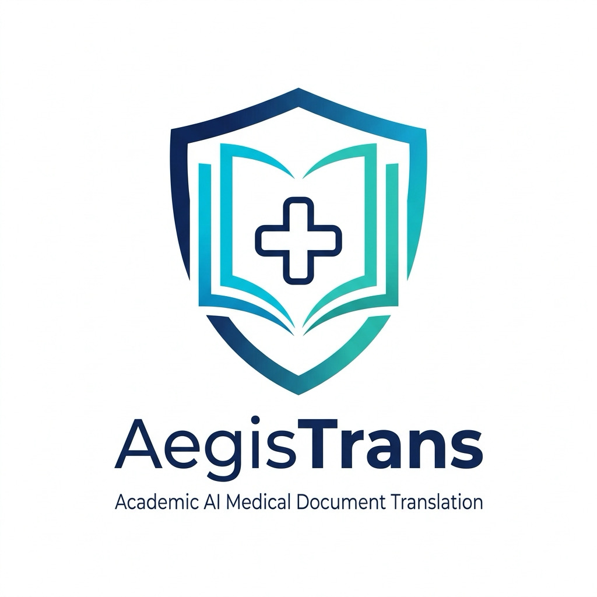
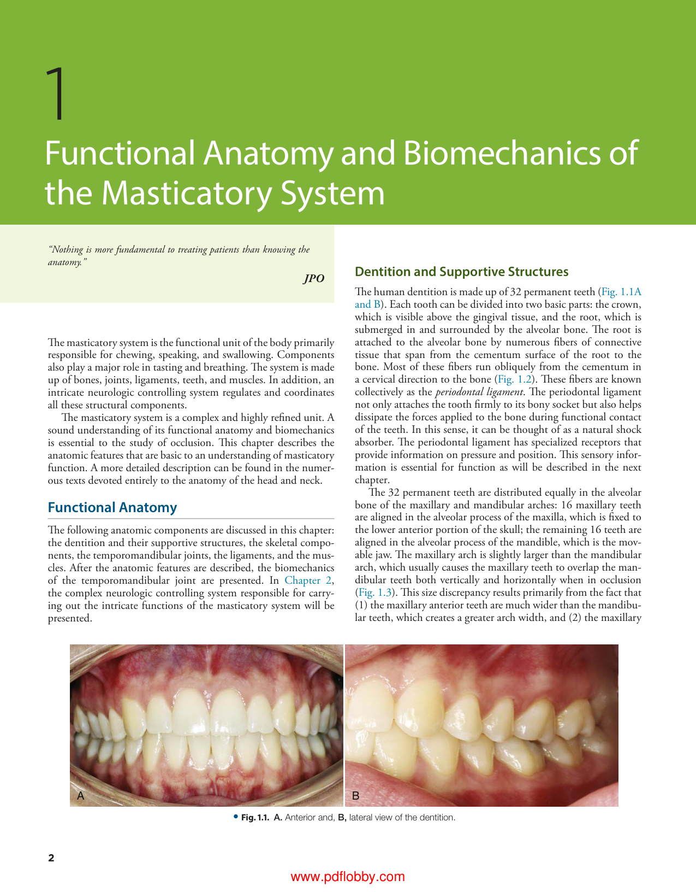
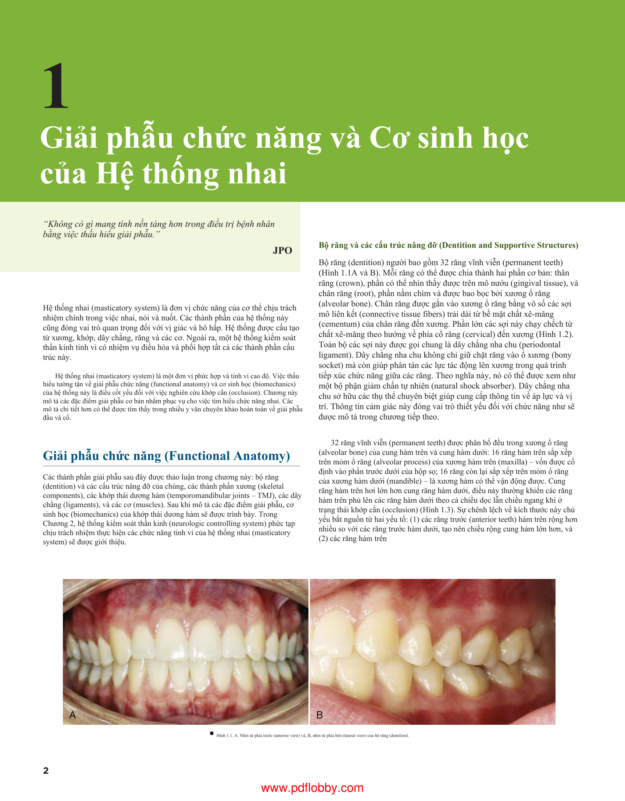

<p align="center">
  
</p>

<h1 align="center">AegisTrans</h1>

<p align="center">
  <strong>Academic Medical and Scientific PDF Textbook Translation System</strong><br>
  Preserves publisher typography, mathematical formulas, tables, figures, and bookmarks while retaining dual-language clinical terminology.
</p>

<p align="center">
  <a href="https://github.com/tunah72/aegistrans/releases/latest"></a>
  <a href="LICENSE"></a>
  
  
  
</p>

<p align="center">
  <a href="#sample-translation-demo">Demo</a> &bull;
  <a href="#key-capabilities">Capabilities</a> &bull;
  <a href="#macos-desktop-application">Desktop App</a> &bull;
  <a href="#medical-textbook-translation-cli">CLI Pipeline</a> &bull;
  <a href="#agent-skill--plugin">Agent Skill & Plugin</a> &bull;
  <a href="#building-from-source">Build</a> &bull;
  <a href="#lineage--acknowledgements">Acknowledgements</a> &bull;
  <a href="#license--takedown-policy">License</a>
</p>

---

## Sample Translation Demo

Below is a side-by-side comparison from a medical textbook pilot (*Okeson – Management of Temporomandibular Disorders and Occlusion*, Elsevier 8th Edition):

<div align="center">
  <table>
    <thead>
      <tr>
        <th width="50%" align="center"><strong>Original English Source</strong></th>
        <th width="50%" align="center"><strong>Vietnamese (Bilingual Terminology Mode)</strong></th>
      </tr>
    </thead>
    <tbody>
      <tr>
        <td valign="top"></td>
        <td valign="top"></td>
      </tr>
    </tbody>
  </table>
</div>

### Translation Highlights
- **Typography and Geometry:** Preserves publisher banner headers, section titles, multi-column geometries, and embedded illustrations without text clipping or abnormal line breaks.
- **Dual-Language Terminology Retention:** Clinical anatomical, pharmacological, and biomechanical terms are rendered in standardized Vietnamese accompanied by standard English in parentheses upon introduction (e.g., `xương hàm dưới (mandible)`, `khớp thái dương hàm (temporomandibular joint – TMJ)`, `dây chằng nha chu (periodontal ligament)`). This supports concurrent subject-matter comprehension and international terminology learning.

---

## Key Capabilities

- **Strict Document Layout Preservation:** Automatically detects text blocks, headings, formulas, tables, and figures using an ONNX layout model. Text is re-typeset into target positions using fine-tuned font metrics.
- **Fault-Tolerant SQLite Checkpointing:** Every translated segment is stored incrementally in a SQLite database (`checkpoint.db`). If translation is interrupted by network failures or power outages, re-running instantly resumes from where it left off without duplicate token consumption.
- **Modular Medical Specialty Profiles:** Features an extensible profile architecture under `medical-translation/profiles/`:
  - `dental`: Dentistry, TMD, Occlusion, Craniofacial Anatomy.
  - `general_medicine`: Internal Medicine, Surgery, Physiology, Pathology, Pharmacology.
- **Chapter Slicing and Bookmark TOC Reconstruction:** Automatically extracts chapter sub-PDFs from a source book based on its PDF bookmark tree, batch translates chapters, and merges them into a unified textbook with complete bookmark navigation intact.
- **Unified Tri-Modal Deployment:**
  - Standalone macOS GUI Application (`AegisTrans.app`)
  - Cross-platform Python CLI for servers and batch automation
  - Autonomous AI Agent Skill & Plugin for Antigravity, Claude, ChatGPT, and Cursor

---

## macOS Desktop Application

Pre-built standalone desktop packages are available for macOS:

1. Download the latest release: **[AegisTrans-macos.zip](https://github.com/tunah72/aegistrans/releases/latest/download/AegisTrans-macos.zip)** (~200 MB).
2. Decompress the archive and place `AegisTrans.app` in your `/Applications` directory.
3. Launch `AegisTrans`.

> [!NOTE]
> **macOS Gatekeeper Notice:**  
> Because AegisTrans is an independent, non-commercial open-source project without a paid Apple Developer certificate, macOS may prompt an *unidentified developer* notice on first launch:
> - **Option A:** Right-click `AegisTrans.app` &rarr; Select **Open** &rarr; Confirm **Open**.
> - **Option B:** Run the quarantine removal command in Terminal:
>   ```bash
>   xattr -cr /Applications/AegisTrans.app
>   ```

### Running on Linux and Windows
Desktop bundles are currently packaged natively for macOS to ensure verified release quality. Linux and Windows users can execute AegisTrans directly with Python:
```bash
python -m app.gui
```

---

## Medical Textbook Translation (CLI)

For long textbooks (200–800+ pages), use the dedicated CLI orchestrator:

### 1. Environment Configuration
Create a `.env` file at the repository root (see `.env.example`):
```env
OPENAI_BASE_URL=http://localhost:20128/v1
OPENAI_API_KEY=your_api_key_or_gateway_token
LLM_MODEL=ag/gemini-3.8-flash-low
```

### 2. Single Book Translation with Checkpoint Resumption
```bash
python scripts/translate_book.py path/to/textbook.pdf \
    --output-dir output/textbook_output \
    --profile dental \
    --concurrency 2
```

### 3. Full Textbook Workflow (Split &rarr; Batch Translate &rarr; Merge TOC)
```bash
# Step 1: Split source textbook into chapter PDFs based on outline bookmarks
python scripts/split_pdf_by_chapters.py books/textbook.pdf --output-dir books/chapters

# Step 2: Batch translate all chapters and assemble final merged PDF
python scripts/translate_all_chapters.py \
    --chapters-dir books/chapters \
    --output-dir output/chapters \
    --final-pdf output/Textbook_Vietnamese.pdf \
    --profile dental \
    --concurrency 2
```

### 4. Zero-Config Google Translate Draft Mode
For rapid single-document translation without API credentials:
```bash
python scripts/translate_pdf.py input.pdf --output-dir output/quick_draft --target-language vi
```

---

## Agent Skill & Plugin

AegisTrans is structured natively as an **AI Agent Plugin and Skill**:

- **Plugin Manifest:** [`plugin.json`](plugin.json)
- **Skill Instructions:** [`SKILL.md`](SKILL.md)
- **Domain Rules:** [`rules/AGENTS.md`](rules/AGENTS.md)
- **Specialty Profiles:** [`medical-translation/`](medical-translation/)

### Using in Antigravity or Agent-Compatible Environments
To enable AegisTrans globally across all workspaces on your machine:
```bash
ln -s /path/to/AegisTrans ~/.gemini/config/plugins/aegistrans
```
AI agents automatically detect `aegistrans` in their skill catalog and can orchestrate book translations, validate formula placeholders, and resume checkpoints autonomously.

---

## Building from Source

```bash
# 1. Clone repository
git clone https://github.com/tunah72/aegistrans.git
cd aegistrans

# 2. Set up virtual environment
python3 -m venv .venv
source .venv/bin/activate

# 3. Install dependencies
pip install -r requirements-app.txt

# 4. Run automated test suite
python -m unittest discover tests

# 5. Build native macOS application bundle
./build.sh
```

---

## Lineage & Acknowledgements

AegisTrans is inspired by and builds upon foundational work in the open-source community:

- **[PDFMathTranslate-next](https://github.com/PDFMathTranslate/PDFMathTranslate-next):** Architectural and conceptual inspiration discovered through Chip Huyen's curated *GoodAIList*.
- **[VI-Translate](https://github.com/breslee1707/VI-Translate):** Created by `breslee1707`. Provided the initial Vietnamese localization layer and desktop GUI concepts.
- **[BabelDOC](https://github.com/funstory-ai/BabelDOC):** Powers layout detection via ONNX and font typography assets.
- **AegisTrans Focus:** Purpose-built for **exhaustive Medical & Dental Textbooks**. Introduces dual-language terminology retention, modular clinical profiles, chapter slicing, bookmark-preserving TOC reconstruction, and SQLite-backed interrupted translation resumption.

---

## License & Takedown Policy

This project is licensed under the **[GNU Affero General Public License v3.0 (AGPL-3.0)](LICENSE)**.

> [!IMPORTANT]
> **Non-Commercial Educational Purpose:**  
> AegisTrans is an independent, non-commercial open-source project created to support medical students, clinical practitioners, dentists, and healthcare researchers. It is provided free of charge with zero commercial intent.
> 
> **Notice and Takedown Policy:**  
> We strictly respect intellectual property rights. If you are a copyright owner, author, or publisher and believe that any sample document, graphic, or code asset in this repository requires modification or removal, please contact the maintainer directly:
> - **Maintainer:** [@tunah72](https://github.com/tunah72)
> - **Issues:** [GitHub Issue Tracker](https://github.com/tunah72/aegistrans/issues)
> 
> All inquiries will be addressed promptly, and requested materials will be updated or removed immediately.
